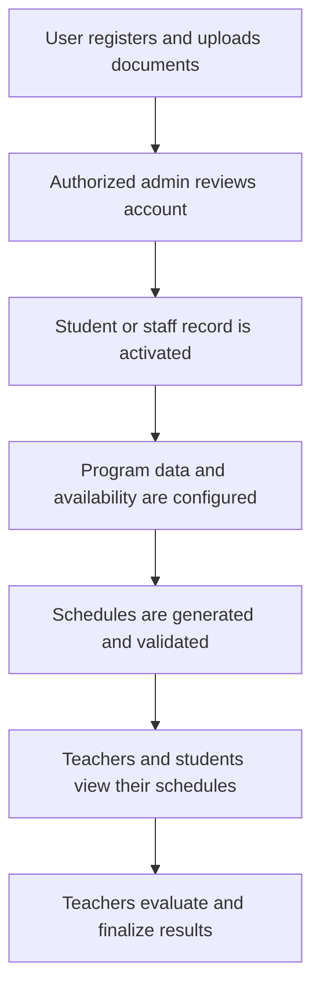

# Student Subject Scheduling and Faculty Loading System

<p align="center">
  
</p>

<p align="center">
  A role-based academic scheduling and faculty workload management system developed for Granby Colleges of Science and Technology.
</p>

## Overview

The Student Subject Scheduling and Faculty Loading System is a web-based academic management platform built to organize curricula, sections, class offerings, student schedules, faculty availability, and teaching loads in one system.

The application supports the full workflow from account registration and approval to class schedule generation, student enrollment, faculty assignment, grade evaluation, and PDF schedule reporting. Access is separated into four user roles so each user sees the tools and information relevant to their responsibilities.

This project was developed as a Bachelor of Science in Information Technology capstone and received the **Outstanding System Development Award** from Granby Colleges of Science and Technology for Academic Year 2025-2026.

## Main Objectives

- Centralize student, faculty, program, curriculum, room, and section records.
- Reduce teacher, room, section, and student schedule conflicts.
- Assign faculty members based on availability, subject preference, program, and teaching-load limits.
- Give students and teachers direct access to their current schedules.
- Support regular and irregular student curriculum tracking.
- Provide account review, approval, and document-verification workflows.
- Generate printable PDF schedules and scheduling reports.

## User Roles

| Role | Main Responsibilities |
| --- | --- |
| Super Admin | Manage programs, subjects, user accounts, account status, staff approvals, rooms, sections, dashboards, and system-wide scheduling records. |
| Program Admin | Manage students within an assigned program, approve student registrations, maintain curricula and sections, configure faculty availability and load limits, set preferred subjects, generate schedules, and manage class enrollments. |
| Teacher | View teaching schedules and load summaries, view class rosters, evaluate students, finalize evaluation results, and download schedule PDFs. |
| Student | View the dashboard, current subjects, curriculum progress, active schedule, schedule history, and downloadable schedule PDF. |

## Core Features

### Authentication and Account Approval

- User registration with personal, academic, program, and role information.
- Password login, logout, reset, confirmation, and email-verification support through Laravel Breeze.
- Private upload of up to 10 PDF supporting documents per registration.
- Pending, active, inactive, and declined account states.
- Super Admin review of teacher and Program Admin registrations.
- Program Admin review of student registrations within the same program.
- Approval and decline history with reviewer information and optional notes.
- Email notifications for account decisions.
- Automatic student academic-record creation after approval.
- Automatic freshman placement in the least-filled active first-year, first-term section with available capacity.

### Program, Subject, and Curriculum Management

- Create and maintain academic programs.
- Configure program duration and number of terms per year.
- Create and maintain program subjects.
- Define active curricula and their effective dates.
- Organize curricula by year level, term number, sequence, and term type.
- Add required, elective, major, minor, general, thesis, and internship subjects to curriculum terms.
- Record subject units, minimum grades, requirements, notes, and prerequisites.
- Set curriculum-term start and end dates used by class offerings.

### Section Management

- Create sections under a program and curriculum.
- Set section name, year level, term, capacity, and status.
- Search and filter active or archived sections.
- View and manage students assigned to each section.
- Transfer students between compatible sections.
- Promote a section to the next curriculum term.
- Prevent promotion while active class offerings remain in the current term.
- Archive a section only when it is empty or all students are marked as graduated.
- Restore archived sections when needed.

### Faculty Availability and Load Management

- Record teacher availability by day and time range.
- Allow Program Admins to maintain availability records for teachers in their own program.
- Configure teacher employment type as regular or part-time.
- Apply default maximum loads of 36 units for regular faculty and 20 units for part-time faculty.
- Assign preferred subjects to teachers using three preference levels.
- Limit faculty-management actions to teachers in the Program Admin's assigned program.

### Schedule Generation and Faculty Loading

The draft scheduling module evaluates required subjects for a section and attempts to produce complete, conflict-free class schedules.

It considers:

- Subjects required by the section's current curriculum term.
- Subject units and required meeting duration.
- Teacher subject preferences.
- Teachers assigned to the same academic program.
- Teacher availability windows.
- Current teaching load and maximum allowed units.
- Existing teacher schedule conflicts.
- Existing room schedule conflicts.
- Existing section schedule conflicts.
- Room availability.
- Other generated rows in the same unsaved draft.
- Existing meetings that should be ignored during rescheduling.

The scheduler prioritizes preferred teachers, then checks same-program teachers as a fallback. A generated row is saved only when a teacher, the required number of meetings, and conflict-free rooms have all been assigned. Incomplete rows are marked for manual review.

Before saving, the application performs another conflict check inside a database transaction. Rescheduled offerings replace their previous meeting records only after the new schedule passes validation.

### Manual Class Offering Management

- Create class offerings for a section and curriculum-term subject.
- Assign a teacher, room, meeting day, and time.
- Retrieve available teachers and rooms based on the selected schedule.
- Validate teacher, room, and section time conflicts.
- Edit or reschedule existing offerings.
- Archive, cancel, unlock, or reactivate offerings as supported by their current state.
- View offering status and finalization information.
- Download individual section schedules and consolidated schedule reports as PDF files.

### Student Management and Enrollment

- Search and filter students within the Program Admin's assigned program.
- Create and update student profiles and academic placement.
- Maintain regular or irregular academic status.
- Track enrolled, dropped, and graduated states.
- Initialize a student's subjects from the assigned curriculum.
- Add custom curriculum subjects for irregular or transferred students.
- Track subject status, including not taken, enrolled, passed, failed, and credited.
- Add students to additional class offerings.
- Prevent duplicate enrollment in subjects already enrolled, passed, or credited.
- Require prerequisite subjects to be passed or credited before enrollment.
- Reject additional classes that overlap with the student's existing schedule.
- Keep a history of current and previous class enrollments.
- Notify students when subject enrollment or status changes.

### Teacher Portal

- Dashboard showing classes for the day, next class, active classes, weekly teaching time, and pending evaluations.
- Weekly and monthly teaching-load summaries.
- Schedule grouped by day and time.
- Class roster containing regular section students and additional enrolled students.
- Student evaluation and result recording.
- Evaluation finalization to prevent further unintended changes.
- Student evaluation-result notifications.
- A4 PDF export of the teacher's schedule.

### Student Portal

- Dashboard containing academic placement, today's meetings, active subjects, and current offerings.
- Combined schedule from the student's regular section and additional class enrollments.
- Current-subject list.
- Curriculum-progress view.
- Schedule history.
- A4 PDF export of the student's schedule.

### Dashboards and Reporting

- Student counts grouped by account and academic status.
- Regular and irregular student totals.
- Pending approval counts.
- Active teacher, program, section, and room totals.
- Current and upcoming class information.
- Enrollment totals by program.
- Yearly active-student data.
- Recent-user information.
- Printable section, teacher, student, and consolidated schedule reports.

## Typical System Workflow



## Scheduling Safeguards

| Safeguard | Behavior |
| --- | --- |
| Teacher conflict check | Prevents a teacher from being assigned to overlapping meetings. |
| Room conflict check | Prevents a room from being used by more than one class at the same time. |
| Section conflict check | Prevents a section from receiving overlapping class meetings. |
| Student conflict check | Blocks additional enrollment when it overlaps with an existing enrolled class. |
| Faculty-load check | Compares active assigned units with the teacher's configured maximum units. |
| Availability check | Generates candidate slots only inside the teacher's recorded availability. |
| Preferred-subject priority | Prioritizes faculty whose preferred-subject records match the scheduled subject. |
| Program boundary check | Restricts Program Admin actions to records belonging to their assigned program. |
| Save-time revalidation | Rechecks database and draft conflicts inside a transaction before committing. |
| Curriculum validation | Confirms that a scheduled subject belongs to the section's current curriculum term. |
| Prerequisite validation | Requires prerequisite subjects to be passed or credited before additional enrollment. |

## Technology Stack

### Backend

- PHP 8.2 or later
- Laravel 12
- Laravel Breeze
- Laravel Eloquent ORM and Query Builder
- Laravel Notifications and database queues
- Livewire 3
- DomPDF for PDF generation

### Frontend

- Blade templates
- Tailwind CSS 3
- Alpine.js
- JavaScript
- Vite 7

### Database

- MySQL 8 or later is recommended.

The scheduling queries use MySQL-specific functions such as `TIMESTAMPDIFF` and `FIELD`, so SQLite is not recommended for the complete scheduling workflow.

## Application Structure

```text
app/
  Actions/                 Reusable application actions
  Http/Controllers/        Role-based controllers and scheduling logic
  Http/Middleware/         Role and account-status authorization
  Http/Requests/           Form-request validation
  Livewire/                Interactive section listing
  Models/                  Eloquent domain models and relationships
  Notifications/           Account, subject, and evaluation notifications
database/
  factories/               Test-data factories
  migrations/              Database schema changes
  seeders/                 Role and Super Admin seeders
public/
  images/                  School and application images
resources/
  css/                     Tailwind application styles
  js/                      Frontend JavaScript entry points
  views/                   Blade views grouped by role and module
routes/
  auth.php                 Authentication routes
  web.php                  Role-based application routes
tests/
  Feature/                 Authentication and profile feature tests
  Unit/                    Unit tests
```

## Main Data Entities

- Users and roles
- User approval records and uploaded documents
- Programs and Program Admin assignments
- Subjects and subject prerequisites
- Curricula, curriculum terms, and curriculum-term subjects
- Sections and rooms
- Student academic records
- Student curriculum subjects and custom curriculum subjects
- Teacher availability records
- Teacher load settings and preferred subjects
- Class offerings and class meetings
- Student class enrollments
- Class-offering finalizations

## Local Installation

### Prerequisites

Install the following before setting up the project:

- PHP 8.2 or later
- Composer
- MySQL 8 or later
- Node.js and npm
- Git

### 1. Clone the repository

```bash
git clone https://github.com/nickos8/Faculty-Loading-System.git
cd Faculty-Loading-System
```

### 2. Install PHP dependencies

```bash
composer install
```

### 3. Install frontend dependencies

```bash
npm install
```

### 4. Create the environment file

On Windows Command Prompt:

```bat
copy .env.example .env
```

On macOS or Linux:

```bash
cp .env.example .env
```

Generate the application key:

```bash
php artisan key:generate
```

### 5. Configure MySQL

Create a MySQL database, then update the database section of `.env`:

```env
DB_CONNECTION=mysql
DB_HOST=127.0.0.1
DB_PORT=3306
DB_DATABASE=faculty_loading_system
DB_USERNAME=root
DB_PASSWORD=
```

Configure the mail variables as well if account and evaluation notifications should be delivered by email.

### 6. Prepare the database

```bash
php artisan migrate --seed
```

The seeders create the four application roles and a development Super Admin account. Review `database/seeders/SuperAdminSeeder.php` and replace its default credentials before using the project outside a local development environment.

### 7. Build the frontend

For development:

```bash
npm run dev
```

For a production build:

```bash
npm run build
```

### 8. Start the application

```bash
php artisan serve
```

Open `http://127.0.0.1:8000` in a browser.

To run the web server, queue worker, Vite, and application log viewer together:

```bash
composer run dev
```

## Notifications and Queue Worker

Some notifications can be queued. When they are enabled, run:

```bash
php artisan queue:work
```

Set the required `MAIL_*` values in `.env` for SMTP delivery. During local development, the log mailer can be used to write outgoing email content to the application log.

## Testing

Run the automated test suite with:

```bash
php artisan test
```

The repository currently includes Laravel Breeze authentication tests, password and email-verification tests, profile tests, and basic example tests. Core curriculum, scheduling, enrollment, approval, and evaluation workflows still need dedicated automated test coverage.

## Database Setup Note

The current repository contains migrations for most domain tables, but parts of the application reference schema definitions that are not fully represented by creation migrations in the repository. These include the original creation of `rooms`, `sections`, and `subject_prerequisites`, along with several extended columns used by the user, subject, curriculum-term, and class-meeting modules.

For a reproducible clean installation, restore the missing migrations from the original project history or add equivalent migrations before running the system on a new database. If the project was originally developed against an existing database, export and document that schema before deployment.

## Current Project Status

This repository is an academic capstone and portfolio project. The main role-based screens and business workflows are implemented. Before production deployment, the following work is recommended:

- Restore and verify the complete database migration history.
- Remove committed environment files, generated dependencies, and temporary development files from version control.
- Replace all development credentials and application secrets.
- Protect every scheduling and PDF route with the intended authentication and role middleware.
- Remove duplicate routes and unused controller imports.
- Add automated tests for scheduling conflicts, faculty-load limits, approvals, enrollment prerequisites, evaluations, and authorization boundaries.
- Run security, performance, accessibility, and production-configuration reviews.

## Recognition

**Outstanding System Development Award**<br>
Granby Colleges of Science and Technology<br>
Academic Year 2025-2026

The project was also presented during the institution's thesis project symposium.

## Repository

[nickos8/Faculty-Loading-System](https://github.com/nickos8/Faculty-Loading-System)
